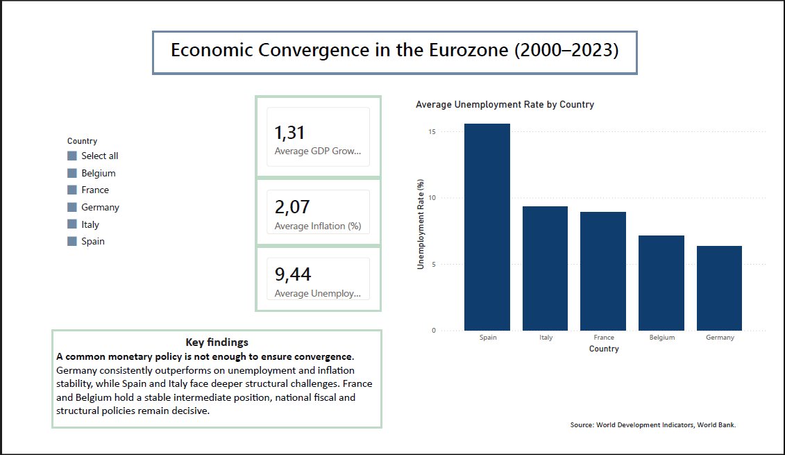
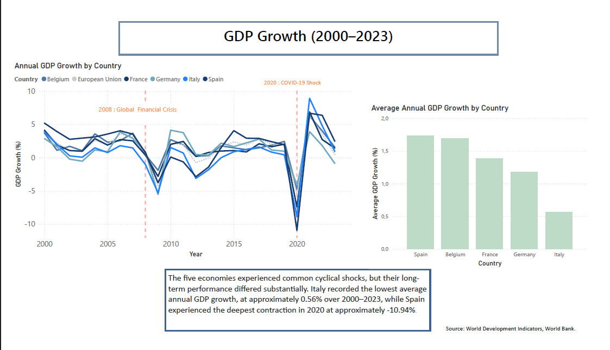
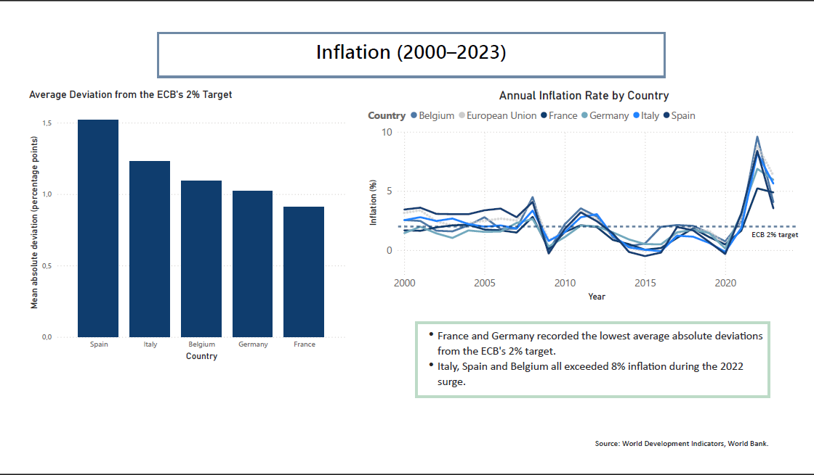
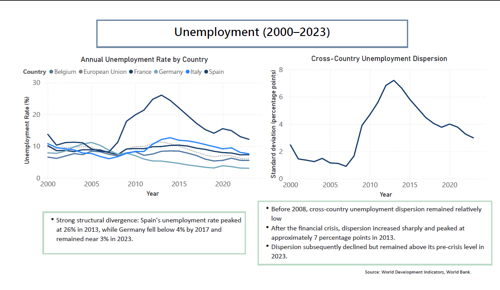

# Economic Convergence in Selected Eurozone Economies (2000–2023)

## Project Overview

This project examines whether five selected major Eurozone economies — **Belgium, France, Germany, Italy and Spain** — converged or diverged in terms of **GDP growth, inflation and unemployment** between 2000 and 2023.

Although these countries share a common monetary policy under the European Central Bank, their long-term economic outcomes remain substantially different. The analysis therefore distinguishes between:

- **common cyclical movements**, driven by shared shocks and monetary conditions;
- **structural convergence or divergence**, reflected in persistent cross-country differences.

The project combines a Python notebook for data preparation and economic analysis with a four-page Power BI dashboard for interactive reporting and visual communication.

---

## Research Question

> To what extent did Belgium, France, Germany, Italy and Spain converge in GDP growth, inflation and unemployment between 2000 and 2023?

---

## Project Outputs

This repository contains:

- three original World Bank indicator datasets;
- a reproducible Jupyter Notebook;
- data cleaning and transformation steps;
- descriptive statistics and time-series analysis;
- a correlation heatmap and cross-indicator scatterplots;
- a four-page Power BI dashboard;
- a PDF dashboard export and dashboard screenshots;
- economic interpretations, policy implications and limitations.

---

## Tools and Skills

### Tools

- Python
- Pandas
- NumPy
- Matplotlib
- Seaborn
- Jupyter Notebook
- Power Query
- Power BI
- DAX
- GitHub

### Skills Demonstrated

- Data cleaning and transformation
- Data validation
- Exploratory data analysis
- Descriptive statistics
- Correlation analysis
- Time-series visualisation
- Cross-country comparison
- DAX measure creation
- Dashboard design
- Economic interpretation
- Policy-oriented communication
- Technical documentation in English

---

## Data

### Source

**World Development Indicators — World Bank**

### Period

**2000–2023**

### Geographic Scope

The five countries included in the main analysis are:

- Belgium
- France
- Germany
- Italy
- Spain

The **European Union aggregate** is included in selected Power BI time-series charts as a benchmark. It is excluded from:

- country rankings;
- dashboard KPI calculations;
- cross-country unemployment dispersion;
- the main five-country conclusions.

### Indicators

| Indicator | Definition | World Bank Code |
|---|---|---|
| GDP Growth | Annual percentage growth rate of GDP | `NY.GDP.MKTP.KD.ZG` |
| Inflation | Consumer price inflation, annual percentage | `FP.CPI.TOTL.ZG` |
| Unemployment | Percentage of the total labour force | `SL.UEM.TOTL.ZS` |

### Source Files

The analysis uses the following raw World Bank files:

```text
API_NY.GDP.MKTP.KD.ZG_DS2_en_csv_v2_57.csv
API_FP.CPI.TOTL.ZG_DS2_en_csv_v2_285.csv
API_SL.UEM.TOTL.ZS_DS2_en_csv_v2_33398.csv
```

The notebook loads, cleans, reshapes and merges these datasets during execution.

---

## Data Preparation

The original World Bank data were downloaded as three separate CSV files covering GDP growth, inflation and unemployment.

The preparation process included:

1. Removing the first four World Bank metadata rows;
2. Reading the correct row as the column header;
3. Filtering the data to the selected countries;
4. Selecting the period from 2000 to 2023;
5. Reshaping the datasets from wide to long format;
6. Converting years and indicator values to numerical types;
7. Merging the three indicators using country and year;
8. Checking missing values and indicator consistency;
9. Creating an analysis-ready DataFrame inside the notebook.

The merged dataset follows this structure:

| Country | Year | Inflation | GDP Growth | Unemployment |
|---|---:|---:|---:|---:|
| Belgium | 2000 | 2.54 | 3.72 | 6.59 |
| Germany | 2000 | 1.44 | 2.88 | 7.92 |
| Spain | 2000 | 3.43 | 5.20 | 13.79 |

---

## Analytical Approach

### 1. Time-Series Analysis

Annual trends are compared across countries to identify:

- common business cycles;
- asymmetric responses to major shocks;
- persistent structural differences;
- post-crisis recovery patterns.

### 2. Period Averages

Average GDP growth, inflation and unemployment are calculated for each country over 2000–2023.

These indicators provide concise comparisons of long-term performance, although period averages may conceal substantial changes between sub-periods.

### 3. Cross-Country Unemployment Dispersion

For each year, the population standard deviation of unemployment across Belgium, France, Germany, Italy and Spain is calculated in Power BI.

This produces one cross-country dispersion value for every year:

- decreasing dispersion suggests that national unemployment rates are becoming more similar;
- increasing dispersion suggests that national labour-market outcomes are diverging.

The European Union aggregate is excluded because it is a benchmark rather than an individual country observation.

### 4. Inflation Stability

Inflation stability is assessed using the **mean absolute deviation from the ECB's 2% target**.

For each country, the Power BI analysis:

1. calculates the absolute annual distance between inflation and 2%;
2. averages those distances over 2000–2023.

This is more informative than average inflation alone because positive and negative deviations cannot offset one another.

### 5. Cross-Indicator Relationships

A correlation heatmap and scatterplots are used to explore relationships between:

- GDP growth and unemployment;
- inflation and unemployment;
- GDP growth and inflation.

These relationships are descriptive and are not interpreted as causal.

> **Methodological note:** Correlation does not imply causality. The observed relationships may reflect common macroeconomic shocks, country-specific institutions or omitted variables.

> **Okun's law note:** Okun's law generally relates output growth to changes in unemployment rather than to the unemployment level. The GDP growth–unemployment scatterplot therefore primarily highlights structural differences across countries.

---

## Key Findings

### GDP Growth

The five economies followed broadly similar cyclical patterns, reflecting their exposure to common shocks and a shared monetary environment.

- Spain experienced the deepest contraction in 2020, at approximately **-10.94%**.
- The subsequent recovery was relatively rapid across the sample.
- Italy recorded the weakest long-term performance, with average annual GDP growth of approximately **0.56%** over 2000–2023.

The results suggest that common business cycles coexist with persistent differences in productive capacity and long-term growth.

### Inflation

During most of the 2010s, inflation remained close to or below the ECB's 2% target before increasing sharply after 2021.

In 2022:

- France recorded inflation of approximately **5.2%**;
- Germany recorded approximately **6.9%**;
- Italy, Spain and Belgium all exceeded **8%**;
- Belgium recorded the highest rate in the sample, at approximately **9.6%**.

France and Germany recorded the lowest mean absolute deviations from the ECB's 2% target over the full period.

### Unemployment

Unemployment displayed the strongest evidence of structural divergence.

- Spain's unemployment rate peaked at approximately **26% in 2013**.
- Germany's unemployment rate fell below **4% in 2017** and remained close to 3% in 2023.
- Italy experienced persistent labour-market weakness, particularly after the Eurozone sovereign-debt crisis.
- Belgium and France occupied intermediate positions.

Cross-country unemployment dispersion increased sharply after the global financial crisis and peaked at approximately **7 percentage points in 2013**.

Although dispersion subsequently declined, substantial labour-market differences remained visible in 2023.

### Cross-Indicator Relationships

The scatterplots reveal clear country clusters, particularly in unemployment.

Spain maintained relatively high unemployment even during years of positive GDP growth, whereas Germany recorded substantially lower unemployment across a wide range of growth outcomes.

This suggests that labour-market performance depends strongly on structural and institutional factors rather than exclusively on short-term GDP growth.

---

## Business and Policy Implications

### Labour-Market Policy

Persistent unemployment differences highlight the importance of:

- active labour-market policies;
- skills development;
- improved matching between workers and employers;
- reduced labour-market segmentation;
- country-specific institutional reforms.

Economic growth alone may not be sufficient to address persistent unemployment when structural barriers remain.

### Growth and Productivity

Italy's weak average GDP growth suggests a need for policies supporting productivity, investment, innovation, business dynamism, human capital and administrative efficiency.

### Fiscal Coordination

Eurozone members cannot use independent monetary policy to respond to country-specific shocks.

National fiscal policy, European coordination and risk-sharing mechanisms therefore remain important for limiting persistent divergence.

### Inflation Management

Differences in national inflation responses imply that a uniform ECB policy can have heterogeneous effects across member states.

Targeted national fiscal measures may therefore complement monetary policy, provided that they do not generate excessive aggregate demand.

---

## Power BI Dashboard

The Power BI report contains four pages.

### 1. Overview

The Overview page presents:

- average GDP growth;
- average inflation;
- average unemployment;
- an interactive country filter;
- a country-level unemployment ranking;
- a summary of the main results.



### 2. GDP Growth

The GDP page presents:

- annual GDP growth by country;
- the European Union benchmark;
- an average GDP growth ranking;
- the 2008 global financial crisis;
- the 2020 COVID-19 shock.



### 3. Inflation

The Inflation page presents:

- annual inflation by country;
- the European Union benchmark;
- the ECB's 2% reference line;
- a country ranking based on mean absolute deviation from the ECB target.



### 4. Unemployment

The Unemployment page presents:

- annual unemployment rates by country;
- the European Union benchmark;
- annual cross-country unemployment dispersion;
- structural differences between national labour markets.



---

## Repository Structure

```text
eurozone-convergence-analysis/
│
├── eurozone_analysis.ipynb
│
├── API_NY.GDP.MKTP.KD.ZG_DS2_en_csv_v2_57.csv
├── API_FP.CPI.TOTL.ZG_DS2_en_csv_v2_285.csv
├── API_SL.UEM.TOTL.ZS_DS2_en_csv_v2_33398.csv
│
├── dashboard/
│   ├── eurozone_dashboard.pbix
│   └── eurozone_dashboard.pdf
│
├── images/
│   ├── overview.png
│   ├── gdp-growth.png
│   ├── inflation.png
│   └── unemployment.png
│
├── README.md
├── requirements.txt
└── .gitignore
```

---

## How to Explore the Project

### Jupyter Notebook

The complete Python analysis is available at:

```text
eurozone_analysis.ipynb
```

The notebook is saved with its outputs, allowing its tables and visualisations to be viewed directly on GitHub.

### Power BI

The interactive report can be opened with Power BI Desktop:

```text
dashboard/eurozone_dashboard.pbix
```

A non-interactive PDF version is available at:

```text
dashboard/eurozone_dashboard.pdf
```

---

## How to Reproduce the Analysis

1. Clone the repository:

```bash
git clone https://github.com/[YOUR GITHUB USERNAME]/eurozone-convergence-analysis.git
```

2. Move into the repository:

```bash
cd eurozone-convergence-analysis
```

3. Install the required Python packages:

```bash
pip install -r requirements.txt
```

4. Launch Jupyter from the repository root:

```bash
jupyter notebook
```

5. Open:

```text
eurozone_analysis.ipynb
```

6. Restart the kernel and run all cells from top to bottom.

> The notebook and the three source CSV files must remain in the same directory unless the file paths in the notebook are updated.

7. Open the `.pbix` file with Power BI Desktop to explore the interactive dashboard.

---

## Limitations

1. The analysis covers only five selected economies and therefore does not represent the entire Eurozone.
2. Only three macroeconomic indicators are considered.
3. The study is primarily descriptive and does not establish causal relationships.
4. Correlation coefficients may be affected by common shocks, structural differences and omitted variables.
5. Period averages can conceal substantial changes between sub-periods.
6. National aggregates hide regional and sectoral heterogeneity.
7. The cross-country standard deviation provides descriptive evidence of convergence or divergence but is not a formal econometric test.
8. The analysis ends in 2023 and does not assess subsequent developments.

---

## Future Extensions

Possible extensions include:

- estimating an Okun's law specification using annual changes in unemployment;
- testing the inflation–unemployment relationship;
- introducing country fixed effects;
- conducting statistical significance tests;
- adding productivity, public debt and real GDP per capita;
- extending the sample to additional Eurozone countries;
- conducting formal sigma- and beta-convergence tests;
- separating the period into pre-crisis, sovereign-debt-crisis, pre-COVID and post-COVID sub-periods.

---

## Author

**Rose Fidalgo Amorim**

Economics and Management student specialising in Applied Economics.

### Areas of Interest

- Quantitative analysis
- Applied economics
- Data analytics
- Business intelligence
- Economic research

**LinkedIn:** https://www.linkedin.com/in/rose-amorim-2287923a3/
**GitHub:** https://github.com/Rose-FidalgoAmorim
